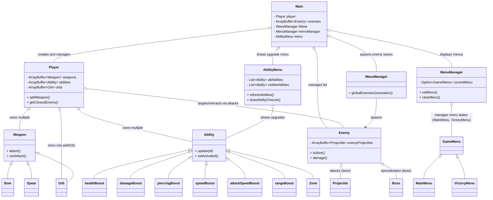

  

# Scala Survivor

**Scala Survivor** is a 2D top-down action game inspired by *Vampire Survivors*, developed in **Scala** as the final project for the *Object-Oriented Programming 101.2* course at **HEI Valais**.

The game is built using the [`gdx2d`](https://hevs-isi.github.io/gdx2d/javadoc/) graphics library.

  
  

---

## Table of Contents

- [Gameplay Overview](#gameplay-overview)
- [Features](#features)
- [Controls](#controls)
- [Progression & Leveling](#progression--leveling)
- [Weapons & Abilities](#weapons--abilities)
- [Complete architecture](#complete-architecture)
- [How to Run](#how-to-run)
- [Screenshots](#screenshots)
- [Credits](#credits)

---

## Gameplay Overview

You control a single character who must survive continuous waves of enemies that grow in strength and number over time. Defeating enemies grants experience, allowing you to level up and choose from a selection of weapons and abilities.

The objective is simple: survive as long as possible, optimize your build, and overcome the final boss.

---

## Features

- **Procedural Waves**: Enemies scale in difficulty as the game progresses.
- **Boss Encounter**: A challenging boss appears at wave 6.
- **Randomized Level-Up System**: Each level-up offers 3 random upgrades—choose wisely.
- **Multiple Weapons**: Includes bow, spear, and orb, each with unique behavior and upgrade paths.
- **Abilities**: Passive and active upgrades such as:
  - Damage, speed, health, piercing, and attack speed boosts
  - Area effects (*Stinky*), and prototype abilities (*Vampirism*, *Lightning*, *Boomerang Axe*)
- **Custom UI**: Live HP and XP bars, inventory display, boss health bar, and kill counter.
- **Debug/Cheat Tools**: For testing and development (see Controls).
- **Smooth Animations**: Fully animated characters and enemies with visual feedback on hits and deaths.

---

## Controls

| Action                             | Key(s)           | Description                                         |
|------------------------------------|------------------|-----------------------------------------------------|
| Move Up                            | `W`              | Move the player upward                              |
| Move Down                          | `S`              | Move the player downward                            |
| Move Left                          | `A`              | Move the player left                                |
| Move Right                         | `D`              | Move the player right                               |
| Select Upgrade (Menus)            | `1`, `2`, `3`     | Choose weapon/ability during level-up               |
| Toggle Debug Mode                  | `TAB`            | Enable debug options                                |
| Reset Player Weapons (Debug)      | `TAB` → `R`       | Reset player weapons                                |
| Clear Abilities (Debug)           | `TAB` → `T`       | Remove all abilities                                |
| Clear Enemies (Debug)             | `TAB` → `Z`       | Remove all enemies                                  |
| Jump to Wave (Debug)              | `TAB` → `8/9/0`   | Skip to waves 3, 5, or boss                         |
| Open Ability Menu (if available)  | `TAB` → `SPACE`   | Manually open upgrade menu                         |

> Level-up menus appear automatically when available.

---

## Progression & Leveling

- **XP System**: Defeat enemies to earn experience. Leveling up happens automatically once enough XP is collected.
- **Upgrade Selection**: Choose one of three randomly selected weapons or abilities at each level-up.
- **Waves**: Difficulty increases with each wave. Stronger enemies spawn as you progress.
- **Boss Fight**: Reaches a climax at wave 6 with a full boss battle.

---

## Weapons & Abilities

### Weapons

- **Bow**: Fast, long-range projectile. Low knockback.
- **Spear**: Slower but more powerful. Can pierce multiple enemies.
- **Orb**: Homing or area-effect weapon. Unique behaviors.

### Abilities

- **Health Boost** – Increase max HP  
- **Damage Boost** – Amplify all damage dealt  
- **Attack Speed Boost** – Fire weapons more quickly  
- **Piercing Boost** – Hit more enemies per attack  
- **Speed Boost** – Increase movement speed  
- **Special Abilities**:  
  - *Stinky*: Area-of-effect damage field  
  - *Vampirism* (not yet implemented): Drain health from enemies  
  - *Lightning* (not yet implemented): Random strikes  
  - *Boomerang Axe* (not yet implemented): Returning projectile weapon  

> Abilities can stack and influence gameplay significantly as the run progresses.

---

## Complete architecture

---

## How to Run

1. Clone this repository
2. Make sure you have [Scala](https://www.scala-lang.org/download/) and [sbt](https://www.scala-sbt.org/download.html) installed
3. Run the Main via your IDE

The game runs in a 1920x1080 window.

---

https://github.com/user-attachments/assets/cf43e5f2-2a99-4a8b-8bf1-cc9bde326caf

## Screenshots

Below are a few screenshots showcasing gameplay and UI elements:

| Wave Gameplay | Weapon Selection | Ability Menu |
|---------------|------------------|--------------|
|  |  |  |

| Debug Mode | Inventory UI |
|------------|--------------|
|  |  |

## Credits

Developed by Dyumes and Skitaarii

---
